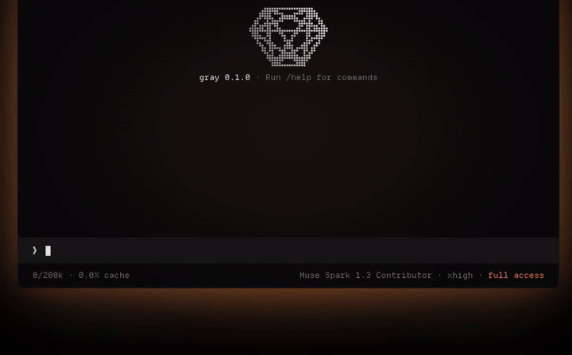

<div align="center">
  
  <h1>gray</h1>
  <p><strong>A minimal, always-on AI agent harness.</strong><br/>One binary. Any model. Runs while you sleep.</p>
  <p>
    <a href="https://gray.alignment.id">Website</a> ·
    <a href="CHANGELOG.md">Changelog</a> ·
    <a href="https://github.com/vstaln/gray/releases">Releases</a>
  </p>
  <p>
    <a href="LICENSE"></a>
    <a href="https://www.rust-lang.org"></a>
    <a href="#platform-support"></a>
    <a href="https://github.com/vstaln/gray/releases"></a>
  </p>
</div>

<br/>

Gray is a coding and automation agent in a single Rust binary. Bring any model — Claude, GPT, Gemini, open models, or a local one — give it a shell, and let it work. Schedule it with cron and the gateway daemon keeps it running with no terminal open.

```bash
curl -fsSL https://gray.alignment.id/install.sh | sh && gray
```

<div align="center">
  
</div>

## Why gray

| | |
|---|---|
| **Any model, your keys** | Native Anthropic Messages API for Claude (prompt caching, extended thinking). Every OpenAI-compatible provider — OpenAI, Google, OpenRouter, DeepSeek, Groq, Mistral, xAI, Fireworks, Together and the rest of the 172 in the bundled models.dev catalog — plus local models via Ollama. |
| **Always on** | The agent schedules its own work with `gray cron add`. `gray gateway install` runs it as a user service, so jobs fire with your terminal closed. |
| **One binary, no runtime** | Static builds for Linux, macOS and Windows. `gray update` self-updates. |
| **Bash is the tool** | Read, search, edit, run — all through one `bash` tool, with background jobs for long work. Point `exec_prefix` at a container or SSH box to run it somewhere else. |
| **Sessions that survive** | JSONL transcripts with branching. `-c` reopens the latest, `/resume` picks any, `/undo` and `/retry` rewind. Context auto-compacts before the limit. |
| **Remembers you** | Cross-session memory of your preferences and project decisions (`gray memory`). |
| **Your setup already works** | Reads project `AGENTS.md` / `CLAUDE.md`, and `SKILL.md` skills from `~/.gray`, `~/.claude`, `~/.agents`, opencode and pi — no porting. Extend further with stdio plugins. |

## Install

```bash
curl -fsSL https://gray.alignment.id/install.sh | sh              # stable
curl -fsSL https://gray.alignment.id/install.sh | sh -s -- beta   # rebuilt on every main push
cargo build --release -p gray                                     # from source
```

**Native Windows 11 x64** (no WSL; Git for Windows supplies the shell). In PowerShell:

```powershell
irm https://gray.alignment.id/install.ps1 | iex
```

The installer checks the release `SHA256SUMS`. For an offline install keep `dist/install.ps1` and the zip together and run `.\dist\install.ps1 -ArchivePath .\gray-stable-x86_64-windows.zip -Sha256 <digest>`. Gateway/cron execution and self-update aren't supported on native Windows yet — see the [Windows guide](docs/windows-preview.md) for beta, offline and WSL installs.

## Quick start

```bash
gray                 # drops you at the prompt
```

| | |
|---|---|
| `/provider` | pick a provider — API key, free tier, or local |
| `/key anthropic` | paste a key (input hidden), stored in `~/.gray/auth.json` |
| `/model` | searchable model picker |
| `gray -p "fix the failing test"` | one-shot, non-interactive (`--json` for machine-readable events) |
| `gray doctor` | check this machine's setup (`--online` also pings the provider) |

An account at [gray.alignment.id](https://gray.alignment.id/account) is optional — it lives in the [gray-account](https://github.com/vstaln/gray-account) plugin (`gray account login` / `whoami` / `logout`), and nothing in gray is gated on it.

## Always on: cron + gateway

```bash
gray cron add "0 9 * * 1-5" "summarize yesterday's commits and open issues"
gray gateway install    # user service: systemd --user, or runit on Void
gray gateway status
```

The model can run `gray cron add` itself, so "check this every morning" just works. Jobs fire from whatever ticks the store: the gateway daemon, `gray cron serve`, a `gray cron tick` host (systemd timer / crontab), or an open REPL. The gateway is a 60s ticker plus a control socket at `$GRAY_HOME/gateway.sock`; it drains an in-flight job on shutdown.

## Commands

Slash commands autocomplete — Enter completes and fires, Tab inserts.

| | |
|---|---|
| `/new` · `/resume [id\|--last\|--all]` | fresh conversation, or reopen one |
| `/model` · `/provider` · `/key` | switch without leaving the chat |
| `/compact [instructions]` | summarize context (also automatic) |
| `/undo` · `/retry` | drop the last exchange · drop it and ask again (files are git's job) |
| type during a turn | steers the running turn at its next step |
| `/context [128k\|1m\|auto]` | inspect or set the window |
| `/thinking` · `/effort [level]` | reasoning on/off, effort level |
| `/usage` | session tokens & cost |
| `/memory` | view cross-session memory |
| `/skills [name] [args]` | list or run a skill |
| `/plugin …` | list · search · install · remove · update · enable · disable · check |
| `/agentsmd` | edit the system prompt |
| `/feedback <text>` | save feedback + open a prefilled GitHub issue |

CLI: `gray resume`, `gray cron`, `gray gateway`, `gray plugin`, `gray memory`, `gray sessions prune`, `gray update`, `gray doctor`. Flags: `-p`, `-c`, `--session <ID>`, `--context-window`, `--json`, `--bare`. `--json` exits `0` success, `1` turn failed, `3` provider/network failure (retryable); error records carry a `code` and a `hint`.

## Extend

**Skills** — `SKILL.md` files from `~/.gray/skills`, `.gray/skills`, and the Claude Code / opencode / agents / pi locations, global and per-project. The model sees the list every turn and reads the one it needs.

**Plugins** — sidecar processes speaking NDJSON over stdio (wire v1, frozen), with timeouts and crash isolation. `gray.yml` profiles order them; [`crates/gray-plugin/testdata/echo.sh`](crates/gray-plugin/testdata/echo.sh) is a copy-paste starting point. More in [docs/plugins.md](docs/plugins.md).

**Run commands elsewhere** — one setting moves every shell command off your machine:

```json
// ~/.gray/config.json
{ "exec_prefix": "docker exec -i dev sh -s" }    // or "ssh box sh -s"
```

The command crosses as text, so quoting, globs and heredocs reach the far shell untouched. Paths don't cross: remote commands start in that account's home.

**Background jobs** — `bash` takes `"background": true` (or `"yield_ms": 1000`) and returns a job id; `action: list|status|output|cancel` manages them. Up to 32 concurrent per session, completion notices arrive between model steps.

## Safety

Gray runs the model's shell commands with **your privileges, no approval prompt, no sandbox**. For untrusted work, run it in a container/VM or set `exec_prefix` to an isolated box. Session transcripts in `~/.gray/sessions` (mode `0600`) keep whatever crossed a tool call, secrets included; `-p` mode scrubs them. Reports: [SECURITY.md](SECURITY.md).

## Reference

**Context window** — `--context-window` / `GRAY_CONTEXT_WINDOW` → provider value → LiteLLM table → fallback. Auto-compacts at `window − 16k`, and compacts + retries once on overflow.

**Environment**

| var | meaning |
|---|---|
| `GRAY_HOME` | config root (default `~/.gray`) |
| `GRAY_API_KEY` / `OPENAI_API_KEY` | API key — env beats stored keys |
| `GRAY_MODEL` · `GRAY_BASE_URL` | defaults before `config.json` |
| `GRAY_CONTEXT_WINDOW` | `128k`, `1m`, `auto` |
| `GRAY_EXEC_PREFIX` | run shell commands through this program |
| `GRAY_NO_MEMORY=1` | disable memory |
| `GRAY_NO_UPDATE_CHECK=1` · `GRAY_AUTO_UPDATE=1` | update check off, or background self-update |
| `GRAY_LOG` | `error`…`trace` → `~/.gray/logs/gray.log` |

### Platform support

| OS / arch | binary | notes |
|---|---|---|
| Linux x86_64 / aarch64 | musl-static | full support, gateway as a user service |
| macOS arm64 / x86_64 | Rust-static, not notarized | curl installs run fine; browser downloads may hit Gatekeeper |
| Windows x86_64 | native, Windows 11+ | Git Bash shell; no gateway/cron execution yet |

**Layout** — `gray` (CLI, TUI, sessions, cron, gateway) · `gray-core` (agent loop) · `gray-provider` (OpenAI-compatible + native Anthropic streaming) · `gray-tools` · `gray-plugin` · `gray-pkg` · `gray-markdown`.

**Stability** — CLI flags, session JSONL, plugin wire v1 and the `~/.gray` layout become a contract at 1.0; best-effort on 0.x. Changes per release: [CHANGELOG.md](CHANGELOG.md).

---

Informed by the projects in [THIRD_PARTY_NOTICES.md](THIRD_PARTY_NOTICES.md) — thanks to them. `cargo install gray` is a different crate; use the installer or build from source.

MIT © 2026 vstaln
